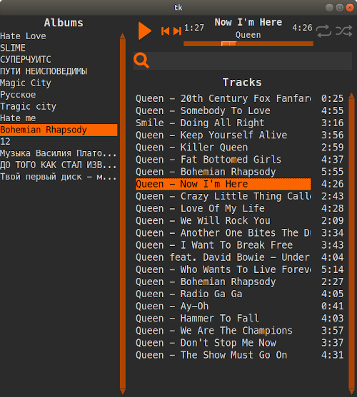
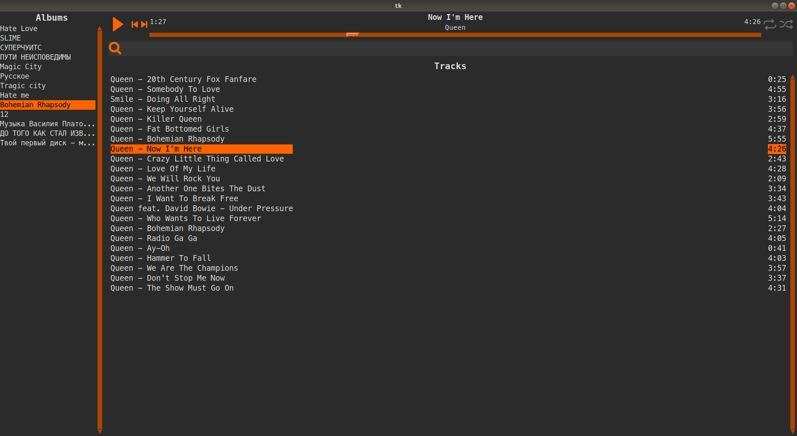

# Music player based on tkinter and python-vlc

### Main feature
This player work like file manager - searching and display playlists ( folders)
in playlist all track can be named like this - "$num filename.mp3" to automagically sort it
### Others features
* Async mp3 length get
* Modern design
* Work with media buttons on bluetooth device or keyboard
* true random shuffle
### Bugs
* Album change when get async length get is still working cause bug with random length on without track name in last row of tracks and error in console
* Some track won't playing by python vlc. Length of this track worng too
### Full-screen screen shoot

